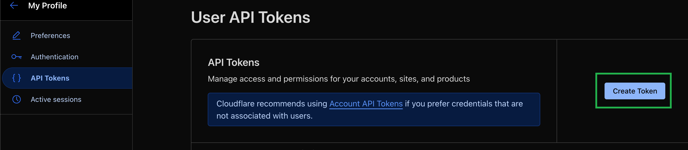
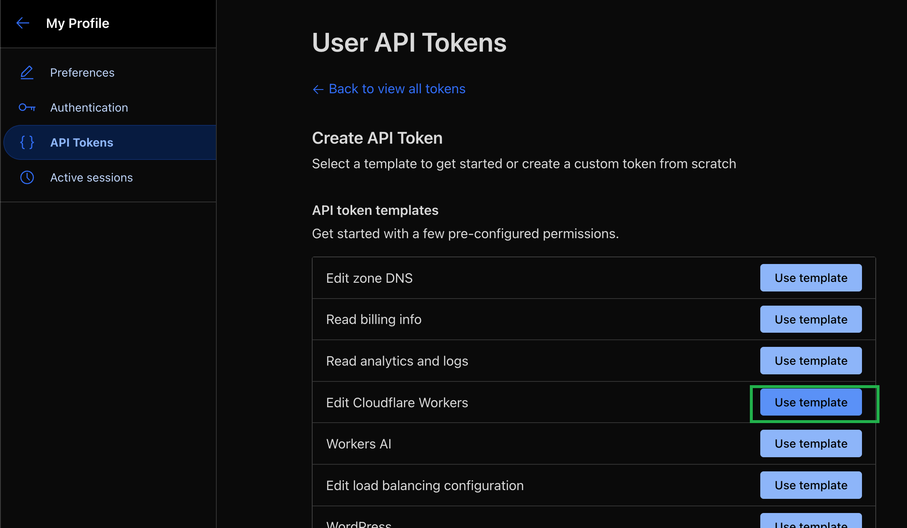
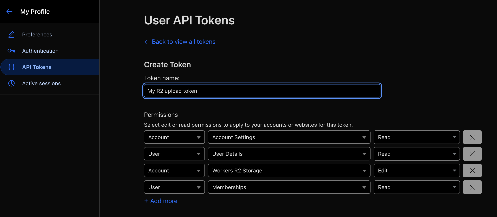
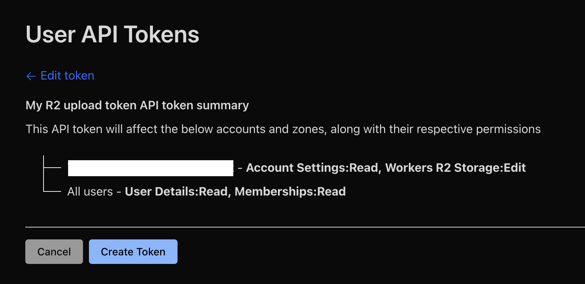
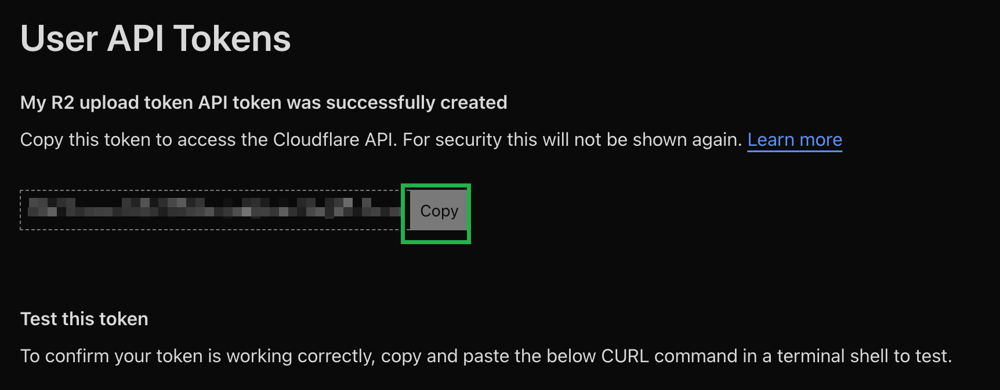

# Dynamic Code Quality Badge with fuck-u-code (GitHub Action)

[](https://deepwiki.com/YaoYinYing/fuck-u-code-github-action)

## CI

[](https://github.com/YaoYinYing/fuck-u-code-github-action/actions/workflows/test.yml)

## Case tests

[](https://github.com/YaoYinYing/fuck-u-code-github-action)
[](https://github.com/YaoYinYing/fuck-u-code-github-action)
[](https://github.com/YaoYinYing/fuck-u-code-github-action)
[](https://github.com/YaoYinYing/fuck-u-code-github-action)
[](https://github.com/YaoYinYing/fuck-u-code-github-action)
[](https://github.com/YaoYinYing/fuck-u-code-github-action)
[](https://github.com/YaoYinYing/fuck-u-code-github-action)
[](https://github.com/YaoYinYing/fuck-u-code-github-action)
[](https://github.com/YaoYinYing/fuck-u-code-github-action)
[](https://github.com/YaoYinYing/fuck-u-code-github-action)
[](https://github.com/YaoYinYing/fuck-u-code-github-action)
[](https://github.com/YaoYinYing/fuck-u-code-github-action)

## Introduction

This GitHub Action runs a **code quality analysis** using the [**fuck-u-code** CLI tool](https://github.com/Done-0/fuck-u-code) and automatically generates a **dynamic status badge** based on the analysis score. The **fuck-u-code** tool evaluates your codebase on a scale of 0–100 (the "shitty code index"), examining factors like complexity, duplication, naming, etc., to determine how "bad" the code is. By default, a higher score means **worse code quality** (100 indicates very poor quality, and 0 indicates very clean code). This Action can *optionally* **reverse the scoring** to treat 100 as a perfect score (good code) for more intuitive badging.

After running the analysis, the Action uses the score to create an **SVG badge** with an appropriate color indicator (red, orange, yellow, or green) based on configurable thresholds. The badge image is generated via the Shields.io service and includes a customizable label and icon. The resulting badge file is then **uploaded as a build artifact** and also published to a **Cloudflare R2 storage bucket**. By hosting the badge on R2 (or another static endpoint), you can embed it in your repository’s README or documentation to display an up-to-date code quality score on each push.

## Prerequisites

Before using this action, ensure the following are set up:

* **GitHub Actions Runner with Go** – The action uses Go to install and run the `fuck-u-code` CLI. GitHub’s default Ubuntu runners (`ubuntu-latest`) come with Go pre-installed. If using a self-hosted runner or a different OS, make sure Go is available (or add a step with `actions/setup-go`).
* **Cloudflare R2 Bucket** – Create a Cloudflare R2 storage bucket where the badge will be stored. If you want to embed the badge publicly, configure the bucket (or a Workers script / custom domain) for public read access. For example, you might enable the R2 **Public Bucket** feature or set up a Cloudflare Worker to serve the bucket content.
* **Cloudflare API Token** – Generate a Cloudflare API token with permissions to **write to R2** (Workers R2 Storage:Edit, Account Settings:Read,Memberships:Read, User Details:Read). Note your Cloudflare Account ID if needed. Save the API token as a GitHub repository secret (e.g. `CLOUDFLARE_API_TOKEN`).
* **R2 Bucket Name** – Note the name of the R2 bucket you created. It will be needed as input. You can hard-code it or store it as a secret (e.g. `R2_BUCKET`). Make sure the bucket exists prior to running the workflow (the action will not create the bucket).
* **Optional**: If your R2 setup requires specifying the account ID (in addition to the token), you may need to provide it to the Cloudflare action (for example via an environment variable or an input `accountId` to `cloudflare/wrangler-action`). In many cases, if the API token is scoped to a single account, you won’t need to separately specify the account ID.

## Inputs

The action supports several inputs to configure its behavior. The primary inputs include the target path to scan, badge customization options, and Cloudflare R2 credentials. The table below summarizes all inputs:

| **Input Name**         | **Required**             | **Default**                  | **Description**                                                                                                                                                                                                                                                                                                               |
| ---------------------- | ------------------------ | ---------------------------- | ----------------------------------------------------------------------------------------------------------------------------------------------------------------------------------------------------------------------------------------------------------------------------------------------------------------------------- |
| `target-path`          | **Yes**                  | *(none)*                     | Path to the source code directory to analyze, relative to the repository root (for example, `.` for whole repo or `src` for a sub-folder).                                                                                                                                                                                    |
| `fuck-u-code-args`     | No                       | (empty string)               | Additional arguments to pass to the `fuck-u-code` CLI. Use this to customize analysis (e.g. `--exclude "pattern"` to skip files, `--top 10` to limit output, or `--lang en-US` for English output).                                                                                                                           |
| `reverse-score`        | No                       | `"false"`                    | Whether to reverse the scoring interpretation. If `"true"`, a higher badge score indicates better code (so a raw tool score of 0 becomes 100 on the badge). If `"false"` (default), the badge displays the raw fuck-u-code score (higher = worse code).                                                                       |
| `badge-text`           | No                       | `fuck--u--code`              | Text label to display on the badge. **Note:** Shields.io requires escaping hyphens in labels, so use double hyphens for any `-` in the text. For example, the default `fuck--u--code` will render as "fuck-u-code" on the badge.                                                                                              |
| `badge-logo-id`        | **Yes** (optional usage) | `go`                         | The logo to show on the badge, specified by the SimpleIcons ID. Defaults to the Go language icon (`go`). For example, use `python` for a Python logo, or set an empty string `""` if no logo is desired. (All logos from [SimpleIcons](https://simpleicons.org) are supported.)                                               |
| `color-bad-score`      | No                       | `red`                        | Badge color for "bad" scores. By default, this applies to fuck-u-code scores **< 60** (worst code quality range). Accepts any color name or hex (e.g. `"red"` or `#FF0000`).                                                                                                                                                  |
| `color-ok-score`       | No                       | `orange`                     | Badge color for "ok" scores (default range **60–89**). Use any CSS color value.                                                                                                                                                                                                                                               |
| `color-good-score`     | No                       | `yellow`                     | Badge color for "good" scores (default range **90–99**).                                                                                                                                                                                                                                                                      |
| `color-perfect-score`  | No                       | `brightgreen`                | Badge color for a "perfect" score (when the score is **100**). For example, bright green indicates a perfect 100 (usually when `reverse-score` is enabled and the code has 0 issues).                                                                                                                                         |
| `badge-artifact-name`  | No                       | `upload-my-awesome-badge`    | Name of the GitHub Actions artifact to upload the badge as. You can change this if you want a custom artifact name.                                                                                                                                                                                                           |
| `badge-file-name`      | No                       | `badge`                      | File name (without extension) for the badge SVG file. The default will produce a file `badge.svg`. You can customize this name especially if you produce multiple badges or want a specific naming scheme.                                                                                                                    |
| `CLOUDFLARE_API_TOKEN` | **Yes**                  | *(none)*                     | Cloudflare API token with R2 access. This is used by the Cloudflare Wrangler action to authenticate and upload the badge file to your R2 bucket. Typically you pass in the secret as shown in the examples.                                                                                                                   |
| `R2_BUCKET`            | **Yes**                  | *(none)*                     | The name of your Cloudflare R2 bucket where the badge will be stored. (This should correspond to an existing bucket in your Cloudflare account.)                                                                                                                                                                              |
| `R2_badge_path`        | No                       | `my-awesome-badges/example/` | The *path* (folder or key prefix) within the R2 bucket to place the badge file. You can use this to organize badges. For example, `projectXYZ/quality/` will cause the badge to be uploaded to `projectXYZ/quality/<badge-file-name>.svg` in the bucket. **Ensure this path ends with a slash** if you intend it as a folder. |

> **Note:** The color range thresholds (50 and 80 by default) correspond to the raw fuck-u-code score when `reverse-score` is false. If you enable `reverse-score:true`, effectively the "bad" range `<50` will apply when the code quality is extremely poor (raw score > 50), and the "good/perfect" colors will apply to high badge values (which come from low raw scores). You can adjust the color breakpoints by modifying the default color inputs if desired.

## Usage Example

To use this action, create a workflow YAML (for example, `.github/workflows/fuck-u-code.yml`) in your repository. Below is a complete example workflow that runs the **fuck-u-code badge action**:

```yaml
name: Fuck U Code Scan

on:
  push:
    branches: [main]
  pull_request:
    branches: [main]
  release:
    types: [created]
  workflow_dispatch:

jobs:
  scan-code:
    runs-on: ubuntu-latest
    steps:
      - name: Checkout Repository
        uses: actions/checkout@v4

      - name: Run fuck-u-code Analysis
        uses: YaoYinYing/fuck-u-code-github-action@v1.0.1
        with:
          target-path: src                        # analyze the 'src' directory
          reverse-score: "true"                   # treat higher score as better code
          badge-text: fuck--u--code score         # label on the badge (renders as "fuck-u-code score")
          badge-file-name: fuck-u-code_scan       # output badge filename -> fuck-u-code_scan.svg
          badge-logo-id: python                   # use Python logo on the badge
          badge-artifact-name: upload-my-awesome-badge-${{ github.run_id }}
          CLOUDFLARE_API_TOKEN: ${{ secrets.CLOUDFLARE_API_TOKEN }}
          R2_BUCKET: ${{ secrets.R2_BUCKET }}
          R2_badge_path: badge_dir_with_uniq_name/ProjectName/fuck-u-code
```

In the example above:

* The workflow triggers on pushes, pull requests to the main branch, and on new releases, as well as manually (dispatch).
* The job runs on Ubuntu (which has Go available).
* We use the action from this repository (`YaoYinYing/fuck-u-code-github-action`), pinned to a specific commit for stability. (You may use a tagged version or commit SHA as shown; replace with the latest version or a tag like `@v1` when available.)
* **Inputs used**:

  * `target-path: "src"` – Only the `src` directory is scanned (adjust as needed; you could use `.` to scan the whole repo).
  * `reverse-score: "true"` – We reverse the scoring so that a cleaner codebase yields a higher badge score (making 100 equivalent to perfect code). This is recommended, as fuck-u-code’s raw score treats higher as worse.
  * `badge-text: "fuck--u--code score"` – The badge will display the text "fuck-u-code score" on the left side.
  * `badge-file-name: "fuck-u-code_scan"` – The badge SVG file will be named `fuck-u-code_scan.svg`.
  * `badge-logo-id: "python"` – Adds the Python logo to the badge (since this example might be for a Python project). You can use any SimpleIcons key or leave it as default (Go icon) or `""` for no icon.
  * `badge-artifact-name: "upload-my-awesome-badge-${{ github.run_id }}"` – Sets a unique artifact name for each run by including the GitHub run ID. This ensures each workflow run’s artifact is distinct. (You could also use a fixed name; by default it's `upload-my-awesome-badge` which would be overwritten each run.)
  * `CLOUDFLARE_API_TOKEN` and `R2_BUCKET` are pulled from secrets – These should be configured in your repository secrets as discussed in **Prerequisites**. The Cloudflare API token grants access to R2, and `R2_BUCKET` is the name of your bucket.
  * `R2_badge_path: "badge_dir_with_uniq_name/ProjectName/fuck-u-code"` – This specifies the folder path in the bucket where the badge will be stored. In this example, the badge SVG will be uploaded to **`<bucket>/badge_dir_with_uniq_name/ProjectName/fuck-u-code/fuck-u-code_scan.svg`** in R2. You might set this to something unique for your project to avoid name collisions if the bucket is shared (for example, use your repository or project name in the path).

When this workflow runs, it will perform the following steps internally:

1. Check out the code and install the latest **fuck-u-code** CLI (`go install ...`).
2. Run `fuck-u-code analyze` on the specified path, producing a detailed report and capturing the overall score out of 100.
3. Determine the **score value** and **badge color** according to the thresholds and whether `reverse-score` is enabled.
4. Construct a Shields.io URL for the badge using the label, score, color, and logo, then download the generated SVG badge.
5. Upload the badge SVG as a GitHub Actions artifact (so you can download it from the workflow run page if needed).
6. Upload the badge SVG to the Cloudflare R2 bucket at the given path (using the `cloudflare/wrangler-action`).
7. Finally, the action echoes a Markdown snippet in the logs containing the badge image reference, for easy copying.

## Create a proper Cloudflare R2 token

1. Go to the Cloudflare dashboard.
2. User -> Profile -> API Tokens -> Create Token
  
3. Pick `Edit Cloudflare Workers` -> `Use template`
  
4. Edit the token name and permissions.
  
5. Confirm the permissions.
  
6. Copy the token and add to the repo secrets.
   

## Accessing and Embedding the Badge

Once the action has run successfully, you will have an SVG badge file in your R2 bucket. To use this badge in your repository README or any webpage, you need to reference its public URL. How to access the file depends on your Cloudflare R2 setup:

* **Using Cloudflare Public Bucket**: If you enabled public access for the R2 bucket, Cloudflare provides a public endpoint. The URL format is:

  ```
  https://<account_id>.r2.cloudflarestorage.com/<R2_BUCKET>/<R2_badge_path>/<badge-file-name>.svg
  ```

  You should replace `<account_id>` with your Cloudflare account ID, `<R2_BUCKET>` with your bucket name, and the path/file as configured. For example, if your account ID is `abcd1234abcd1234` and bucket is `my-badges`, using the example inputs above, the badge URL would be:
  `https://abcd1234abcd1234.r2.cloudflarestorage.com/my-badges/badge_dir_with_uniq_name/ProjectName/fuck-u-code/fuck-u-code_scan.svg`
* **Using Custom Domain or Worker**: Alternatively, you might serve the bucket through a Cloudflare Worker or bind it to a custom domain. In that case, use the appropriate domain/path for your setup (for instance, `https://badges.mywebsite.com/.../badge.svg` if you mapped a domain to the bucket or worker).

With the correct URL in hand, you can embed the badge in Markdown. For example, in your README you might add:

```markdown

```

This Markdown will display the badge image. You can also hyperlink the badge to something (for instance, the action or a documentation page) by using the full `[](link)` syntax. For example:

```markdown
[](https://github.com/Done-0/fuck-u-code)
```

In the above snippet, the badge image is clickable and links to the fuck-u-code project page (you could instead link to your project’s code quality report or any relevant page).

> **Tip:** After each workflow run, the action prints the expected badge Markdown in the job log (between a "badge path" header and footer). You can copy this directly from the log output — it contains the correct URL and label based on your inputs, making it easy to insert into your README.

Finally, whenever your workflow runs (on new pushes or PRs), it will update the badge SVG in the R2 bucket. Since the URL remains the same, the embedded badge will automatically reflect the latest code quality score. This provides an up-to-date indicator of your project’s code health.

## Further Information

* **fuck-u-code Documentation:** See the [fuck-u-code GitHub repository](https://github.com/Done-0/fuck-u-code) for more details on how the code quality score is determined and for CLI usage documentation. This action is essentially an integration of that tool into your CI/CD pipeline for continuous code quality monitoring.
* **Cloudflare R2:** Refer to Cloudflare’s documentation on [R2 public buckets](https://developers.cloudflare.com/r2/data-access/public-buckets/) or using R2 with Workers if you need help setting up public access to the badge file.
* **Shields.io Badge Service:** The badge image is generated via [Shields.io](https://shields.io/). You can customize the appearance (colors, logos, label text) through the action inputs as described, which feed into Shields.io’s parameters. For more custom badge options, Shields.io documentation can be consulted, though the defaults provided should cover most use cases.
